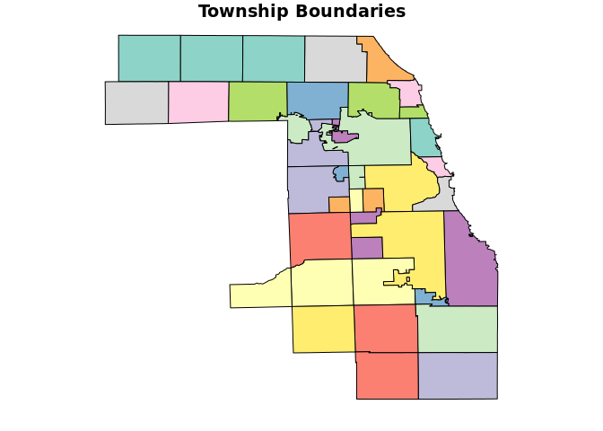
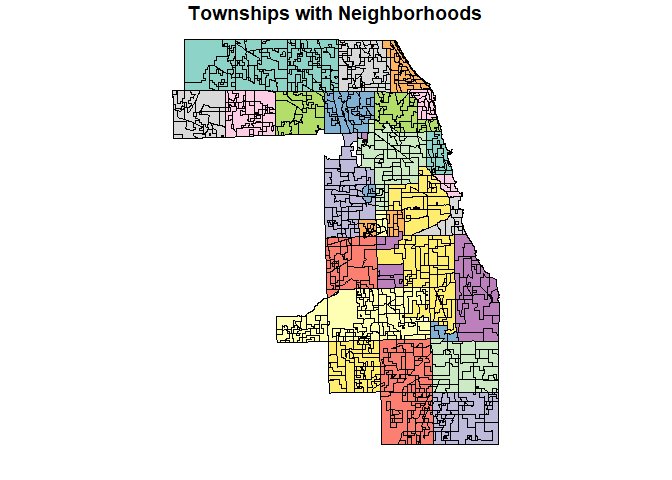

<!-- README.md is generated from README.Rmd. Please edit that file -->

# CCAO Package <a href='https:/glue.tidyverse.org'></a>

A package to manage, distribute, and version control *CCAO-specific*
functions. These functions are used throughout CCAO applications,
models, and diagnostics. For generalized versions of assessment-related
functions, see
[assessR](https://gitlab.com/ccao-data-science---modeling/packages/assessr).

## Installation

You can install the released version of `ccao` directly from GitLab by
running the following R command after installing `remotes`:

``` r
remotes::install_gitlab("ccao-data-science---modeling/packages/ccao")
```

Once it is installed, you can use it just like any other package. Simply
call `library(ccao)` at the beginning of your script.

## Example Usage

This package contains spatial dataframes representing CCAO
administrative boundaries. Note that you **must have the `sf` package
installed and loaded** in order to correctly load spatial dataframes.

``` r
library(sf)
library(ccao)

# Plot township boundaries alone
plot(ccao::town_shp[1], main = "Township Boundaries")
```



``` r
# Plot township boundaries with neighborhoods
plot(ccao::nbhd_shp[1], main = "Townships with Neighborhoods")
```


