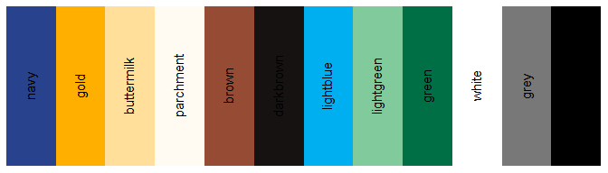

<!-- README.md is generated from README.Rmd. Please edit that file -->

# CCAO package <a href='https://gitlab.com/ccao-data-science---modeling/packages/ccao'></a>

A package to manage, distribute, and version control *CCAO-specific*
functions. These functions are used throughout CCAO applications,
models, and diagnostics. For generalized versions of assessment-related
functions, see
[assessR](https://gitlab.com/ccao-data-science---modeling/packages/assessr).

For detailed documentation on included functions and data, [**visit the
full reference
list**](https://ccao-data-science---modeling.gitlab.io/packages/ccao/reference/).

For examples of specific tasks you can complete with `ccao` functions,
see the [**vignettes
page**](https://ccao-data-science---modeling.gitlab.io/packages/ccao/articles/index.html).

## Installation

You can install the released version of `ccao` directly from GitLab by
running the following R command after installing
[remotes](https://github.com/r-lib/remotes):

``` r
remotes::install_gitlab("ccao-data-science---modeling/packages/ccao")
```

## Basic usage

Here is a quick example using `ccao` functions with included sample
data:

``` r
library(ccao)
library(dplyr)
library(knitr)

# Create a small subsample of data. This is the "raw" data taken from SQL
sample_data <- chars_sample_universe %>%
  select(PIN, TAX_YEAR, TOWN_CODE, AGE, GAR1_SIZE, BSMT) %>%
  slice(c(1, 4, 10))

sample_data %>%
  kable(digits = 3)
```

| PIN            | TAX\_YEAR | TOWN\_CODE | AGE | GAR1\_SIZE | BSMT |
|:---------------|----------:|:-----------|----:|-----------:|-----:|
| 09254040180000 |      2013 | 71         |  57 |          3 |    1 |
| 09361030150000 |      2020 | 71         |  90 |          1 |    1 |
| 10254170360000 |      2020 | 75         |  70 |          3 |    1 |

``` r
# Recode/rename/clean data using town_ and vars_ functions from ccao 
sample_data %>%
  mutate(
    PIN = pin_format_pretty(PIN),
    `Township Name` = town_convert(TOWN_CODE),
    `Township Triad` = town_get_triad(TOWN_CODE, name = TRUE),
    `Next Reass. Year` = town_get_assmnt_year(TOWN_CODE, round_type = "ceiling"),
    AGE = chars_fix_age(AGE, TAX_YEAR, TOWN_CODE)
  ) %>%
  vars_recode(type = "long") %>%
  vars_rename(names_from = "sql", names_to = "pretty") %>%
  kable(digits = 3)
```

| Property Index Number | Year | Township Code | Age | Garage 1 Size | Basement | Township Name | Township Triad | Next Reass. Year |
|:----------------------|-----:|:--------------|----:|:--------------|:---------|:--------------|:---------------|-----------------:|
| 09-25-404-018         | 2013 | 71            |  58 | 2 cars        | Full     | Jefferson     | City           |             2021 |
| 09-36-103-015         | 2020 | 71            |  92 | 1 cars        | Full     | Jefferson     | City           |             2021 |
| 10-25-417-036         | 2020 | 75            |  72 | 2 cars        | Full     | Rogers Park   | City           |             2021 |

## CCAO colors

The CCAO Communications Department created a palette of colors for CCAO
press materials and visualizations. Navy, gold, and buttermilk are the
colors used in the CCAO logo. Typically navy and gold are used for
discrete values in plots. The hex codes for these colors are available
via the named list `ccao_colors`.


