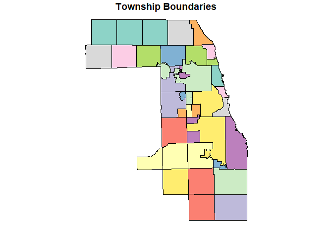
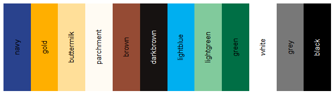

<!-- README.md is generated from README.Rmd. Please edit that file -->

# CCAO Package <a href='https:/glue.tidyverse.org'></a>

A package to manage, distribute, and version control *CCAO-specific*
functions. These functions are used throughout CCAO applications,
models, and diagnostics. For generalized versions of assessment-related
functions, see
[assessR](https://gitlab.com/ccao-data-science---modeling/packages/assessr).

## Installation

You can install the released version of `ccao` directly from GitLab by
running the following R command after installing `remotes`:

``` r
remotes::install_gitlab("ccao-data-science---modeling/packages/ccao")
```

Once it is installed, you can use it just like any other package. Simply
call `library(ccao)` at the beginning of your script.

## Included Functions and Data

#### Functions currently included in `ccao`:

  - `ccao_cod()`, `ccao_prd()`, `ccao_prb()` calculate assessment
    performance statistics in accordance with CCAO Data Science
    Department’s [Standard Operating Procedure on Sales Ratio
    Studies](https://gitlab.com/ccao-data-science---modeling/documentation/wiki_content/-/blob/f1efdcf7b66ab238efa438ee2f35e659222e76af/sops/sales-ratio-studies.md).
    The main changes are enforcement of outlier trimming (top and bottom
    5% of ratios are always dropped) and a strict minimum sample size (N
    must be \>= 30). Each function outputs a named list containing the
    statistic, its confidence interval, whether or not the IAAO standard
    was met, and the number of observations used to calculate the stat.

-----

  - `pin_clean()` Remove separators and whitespace from input PINs and
    warns if a PIN is invalid
  - `pin_format_pretty()` Add dash separators to input PINs to make them
    human-readable

-----

  - `town_convert()` Convert from township name to township number and
    visa versa
  - `town_get_assmnt_year()` Return assessment year nearest to the
    `year` argument for a given input township
  - `town_get_triad()` Return the triad code or name of the input
    town(s)

-----

  - `chars_288_active()` Return a vector of active years given a 288
    start date and township
  - `chars_fix_age()` Fix CCAO property ages that only update every
    assessment cycle
  - `chars_sparsify()` Convert ADDCHARS SQL data to a sparse format that
    can be joined to normal chars datasets
  - `chars_update()` Update the specified characteristic columns using
    each column’s ADDCHARS data

-----

  - `vars_recode()` Bulk recode AS/400 numerically encoded
    characteristics data to a human-readable format
  - `vars_rename()` Bulk rename variable from CCAO SQL to standardized
    or pretty names and visa versa
  - `vars_check_class()` Check if a property class falls within its
    expected square footage and age boundaries

-----

  - `format_as400()` Format predicted values in the specification
    necessary to upload to the AS/400

#### Data currently included in `ccao`:

##### Dictionaries

  - `appeal_dict` Dictionary of appeal reason codes used in CCAO
    internal systems
  - `cdu_dict` Dictionary of CCAO condition-desirability-utility (CDU)
    codes. These codes are usually used to represent different incentive
    conditions
  - `class_dict` Dictionary of property class numeric codes and their
    human-readable equivalent
  - `town_dict` Crosswalk of township names, their equivalent numeric
    codes, and the triad they are in
  - `vars_dict` Crosswalk of human-readable translations of CCAO
    database characteristic codes, modeling variables, and metadata

##### Spatial Data

  - `nbhd_recodes` Recodes for individual neighborhoods
  - `nbhd_shp` Spatial (sf) data frame containing boundaries of CCAO
    neighborhoods<sup>1</sup>
  - `town_shp` Spatial (sf) data frame containing boundaries of Cook
    County townships<sup>1</sup>

##### Sample Data

  - `chars_sample_addchars` Sample from the ADDCHARS SQL table
  - `chars_sample_universe` Sample from the VW\_RES\_UNIVERSE view.
    Contains same PINS as `chars_sample_addchars`.

##### Utility/Other

  - `ccao_colors` Named list of CCAO Comms Department colors, see below
    for palette
  - `chars_cols` List crosswalk of CCAOSFCHARS columns and their
    ADDCHARS equivalents

<sup>1</sup> :warning: The `sf` library **must** be loaded first in
order to load spatial data frames. If you encounter the error `C stack
usage {number} is too close to the limit` when loading the data, update
your version of `sf`

## Usage

### `vars_` Functions

The `vars_` series of functions are designed to simplify working with
messy CCAO data. Current functions can rename columns to standard
formats as well as recode numeric factors to their human-readable
equivalents.

``` r
library(dplyr)
library(tidyr)
library(knitr)
library(ccao)

# Construct a fake data frame of commonly occuring CCAO column names and numeric
# encodings for factors
df <- tibble(
  PIN = rep("1234567", 4),
  GAR1_SIZE = c("1", "3", "0", NA),
  sale_price = rep(132324, 4),
  EXT_WALL = c("1", "2", "0", "4"),
  PORCH = c("1", NA, "3", "2")
)

df %>%
  kable(digits = 3)
```

| PIN     | GAR1\_SIZE | sale\_price | EXT\_WALL | PORCH |
| :------ | :--------- | ----------: | :-------- | :---- |
| 1234567 | 1          |      132324 | 1         | 1     |
| 1234567 | 3          |      132324 | 2         | NA    |
| 1234567 | 0          |      132324 | 0         | 3     |
| 1234567 | NA         |      132324 | 4         | 2     |

``` r

# Recode variables 
df %>%
  vars_recode(type = "long") %>%
  kable(digits = 3)
```

| PIN     | GAR1\_SIZE | sale\_price | EXT\_WALL | PORCH            |
| :------ | :--------- | ----------: | :-------- | :--------------- |
| 1234567 | 1 cars     |      132324 | Frame     | Frame Enclosed   |
| 1234567 | 2 cars     |      132324 | Masonry   | NA               |
| 1234567 | NA         |      132324 | NA        | None             |
| 1234567 | NA         |      132324 | Stucco    | Masonry Enclosed |

``` r

# Rename variables to standard, then recode
df %>%
  vars_rename(names_to = "pretty") %>%
  vars_recode(type = "long") %>%
  kable(digits = 3)
```

| Property Identification Number | Garage 1 Size | Sale Price | Wall Material | Porch            |
| :----------------------------- | :------------ | ---------: | :------------ | :--------------- |
| 1234567                        | 1 cars        |     132324 | Frame         | Frame Enclosed   |
| 1234567                        | 2 cars        |     132324 | Masonry       | NA               |
| 1234567                        | NA            |     132324 | NA            | None             |
| 1234567                        | NA            |     132324 | Stucco        | Masonry Enclosed |

### `chars_` Functions

Below is an example showing the entire process of using the `chars_`
functions to update characteristics data using an ADDCHARS extract. For
more information on this process and why it is necessary, visit the
[Home Improvement
Exemptions](https://datascience.cookcountyassessor.com/wiki/residential/addchars.md)
page on the internal DS wiki.

``` r

# Choose a random sample PIN from the sample ADDCHARS data
sample_chars <- chars_sample_addchars %>%
  filter(QU_PIN == "05273000030000")

# This PIN has a basement and garage renovation followed by a bathroom reno
# three years later
sample_chars %>%
  select(
    QU_PIN, TAX_YEAR, QU_CLASS,
    QU_TOWN, QU_GARAGE_SIZE, QU_SQFT_BLD, QU_BEDS
  ) %>%
  kable(format = "markdown", digits = 3)
```

| QU\_PIN        | TAX\_YEAR | QU\_CLASS | QU\_TOWN | QU\_GARAGE\_SIZE | QU\_SQFT\_BLD | QU\_BEDS |
| :------------- | --------: | --------: | -------: | ---------------: | ------------: | -------: |
| 05273000030000 |      2015 |     20600 |       23 |                3 |             0 |        0 |
| 05273000030000 |      2018 |     20600 |       23 |                0 |           384 |        1 |

``` r

# Sparsify the data. You can see that one 288 ends roughly when the other one
# begins. NOTE: the mutate() on QU_CLASS here is because sometime QU_CLASS is
# equal to 0 (mostly for garage renovations). This is an easy fix
sparse_chars <- sample_chars %>%
  arrange(QU_PIN, TAX_YEAR, QU_CLASS) %>%
  mutate(QU_CLASS = ifelse(QU_CLASS == 0, lag(QU_CLASS), QU_CLASS)) %>%
  chars_sparsify(
    pin_col = QU_PIN,
    year_col = TAX_YEAR, 
    class_col = QU_CLASS,
    town_col = as.character(QU_TOWN),
    upload_date_col = QU_UPLOAD_DATE,
    additive_source = any_of(chars_cols$add_source),
    replacement_source = any_of(chars_cols$rep_source)
  ) %>%
  mutate(QU_CLASS = substr(QU_CLASS, 1, 3))

# The resulting sparse data can be joined onto any data containing CCAOSFCHARS
sparse_chars %>%
  select(
    QU_PIN, YEAR, QU_CLASS, QU_GARAGE_SIZE, 
    QU_SQFT_BLD, QU_BEDS, NUM_288S_ACTIVE
  ) %>%
  kable(format = "markdown", digits = 3)
```

| QU\_PIN        | YEAR | QU\_CLASS | QU\_GARAGE\_SIZE | QU\_SQFT\_BLD | QU\_BEDS | NUM\_288S\_ACTIVE |
| :------------- | ---: | :-------- | ---------------: | ------------: | -------: | ----------------: |
| 05273000030000 | 2015 | 206       |                3 |             0 |        0 |                 1 |
| 05273000030000 | 2016 | 206       |                3 |             0 |        0 |                 1 |
| 05273000030000 | 2017 | 206       |                3 |             0 |        0 |                 1 |
| 05273000030000 | 2018 | 206       |                3 |           384 |        1 |                 2 |
| 05273000030000 | 2019 | 206       |                0 |           384 |        1 |                 1 |
| 05273000030000 | 2020 | 206       |                0 |           384 |        1 |                 1 |
| 05273000030000 | 2021 | 206       |                0 |           384 |        1 |                 1 |

``` r

# Here is an example data frame where the sparse data is merged onto
# characteristic data and the characteristics are then updated using chars_update()
updated_chars <- chars_sample_universe %>%
  filter(PIN %in% sample_chars$QU_PIN) %>%
  left_join(
    sparse_chars,
    by = c("PIN" = "QU_PIN", "TAX_YEAR" = "YEAR", "CLASS" = "QU_CLASS")
  ) %>%
  arrange(PIN, TAX_YEAR) %>%
  chars_update(
    additive_target = any_of(ccao::chars_cols$add_target),
    replacement_target = any_of(ccao::chars_cols$rep_target)
  )

# Show updated characteristics vs ADDCHARS
updated_chars %>%
  ungroup() %>%
  select(
    PIN, TAX_YEAR, CLASS, NUM_288S_ACTIVE, GAR1_SIZE, QU_GARAGE_SIZE,
    BLDG_SF, QU_SQFT_BLD, BEDS, QU_BEDS
  ) %>%
  arrange(PIN, CLASS, TAX_YEAR) %>%
  kable(format = "markdown", digits = 3)
```

| PIN            | TAX\_YEAR | CLASS | NUM\_288S\_ACTIVE | GAR1\_SIZE | QU\_GARAGE\_SIZE | BLDG\_SF | QU\_SQFT\_BLD | BEDS | QU\_BEDS |
| :------------- | --------: | :---- | ----------------: | ---------: | ---------------: | -------: | ------------: | ---: | -------: |
| 05273000030000 |      2015 | 202   |                NA |          1 |               NA |      928 |            NA |    2 |       NA |
| 05273000030000 |      2016 | 202   |                NA |          1 |               NA |      928 |            NA |    2 |       NA |
| 05273000030000 |      2017 | 202   |                NA |         NA |               NA |        0 |            NA |    0 |       NA |
| 05273000030000 |      2018 | 202   |                NA |          1 |               NA |      928 |            NA |    2 |       NA |
| 05273000030000 |      2019 | 202   |                NA |          1 |               NA |      928 |            NA |    2 |       NA |
| 05273000030000 |      2020 | 202   |                NA |          1 |               NA |      928 |            NA |    2 |       NA |
| 05273000030000 |      2013 | 206   |                NA |          1 |               NA |     2637 |            NA |    5 |       NA |
| 05273000030000 |      2014 | 206   |                NA |          1 |               NA |     2637 |            NA |    5 |       NA |
| 05273000030000 |      2015 | 206   |                 1 |          3 |                3 |     2637 |             0 |    5 |        0 |
| 05273000030000 |      2016 | 206   |                 1 |          3 |                3 |     2637 |             0 |    5 |        0 |
| 05273000030000 |      2017 | 206   |                 1 |          3 |                3 |      928 |             0 |    2 |        0 |
| 05273000030000 |      2018 | 206   |                 2 |          3 |                3 |     3916 |           384 |    6 |        1 |
| 05273000030000 |      2019 | 206   |                 1 |          7 |                0 |     3916 |           384 |    6 |        1 |
| 05273000030000 |      2020 | 206   |                 1 |          7 |                0 |     3916 |           384 |    6 |        1 |

### Spatial Data

This package contains spatial data frames representing CCAO
administrative boundaries. Note that you **must have the `sf` package
installed and loaded** in order to correctly load spatial data frames.

``` r
library(sf)

# Plot township boundaries alone
plot(ccao::town_shp[1], main = "Township Boundaries")
```



``` r
# Plot township boundaries with neighborhoods
plot(ccao::nbhd_shp[1], main = "Townships with Neighborhoods")
```


## CCAO Colors


