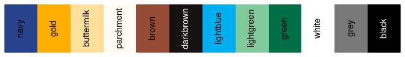

<!-- README.md is generated from README.Rmd. Please edit that file -->

# CCAO <a href='https://github.com/ccao-data/ccao'></a>

[](https://github.com/ccao-data/ccao/actions/workflows/R-CMD-check.yaml)
[](https://github.com/ccao-data/ccao/actions/workflows/test-coverage.yaml)
[](https://github.com/ccao-data/ccao/actions/workflows/lint.yaml)
[](https://codecov.io/gh/ccao-data/ccao)

A package to manage, distribute, and version control *CCAO-specific*
functions. These functions are used throughout CCAO applications,
models, and diagnostics. For generalized versions of assessment-related
functions, see [assessR](https://github.com/ccao-data/assessr).

For detailed documentation on included functions and data, [**visit the
full reference
list**](https://ccao-data.github.io/ccao/reference/index.html).

## Installation

You can install the released version of `ccao` directly from GitHub with
one of the following commands:

``` r
# Using remotes
remotes::install_github("ccao-data/ccao")

# Using renv
renv::install("ccao-data/ccao")

# Using pak
pak::pak("ccao-data/ccao")

# Append the @ symbol for a specific version
remotes::install_github("ccao-data/ccao@1.2.0")
```

## Basic usage

Here is a quick example using `ccao` functions with included sample
data:

``` r
library(ccao)
library(dplyr)
library(knitr)

# Create a small subsample of data. This is the "raw" data taken from SQL
sample_data <- chars_sample_athena %>%
  select(pin, year, char_yrblt, char_gar1_size, char_ext_wall) %>%
  slice(c(1, 2, 5, 14)) %>%
  mutate(township_code = c("72", "73", "71", "72"))

sample_data %>%
  kable(digits = 3)
```

| pin            | year | char_yrblt | char_gar1_size | char_ext_wall | township_code |
|:---------------|:-----|-----------:|:---------------|:--------------|:--------------|
| 10254170360000 | 2015 |       1948 | 7              | 2             | 72            |
| 09363230550000 | 2019 |       1923 | 7              | 3             | 73            |
| 10253190450000 | 2018 |       1951 | 3              | 2             | 71            |
| 13253230040000 | 2019 |       1969 | 7              | 2             | 72            |

``` r

# Recode/rename/clean data using town_ and vars_ functions from ccao
sample_data %>%
  mutate(
    pin = pin_format_pretty(pin),
    township_name = town_convert(township_code),
    triad_name = town_get_triad(township_code, name = TRUE),
    `Next Reass. Year` = town_get_assmnt_year(
      township_code,
      round_type = "ceiling"
    )
  ) %>%
  vars_recode(type = "long") %>%
  vars_rename(names_from = "athena", names_to = "pretty") %>%
  kable(digits = 3)
```

| PIN           | Year | Year Built | Garage 1 Size | Exterior Wall Material | Township Code | Township Name | Triad Name | Next Reass. Year |
|:--------------|:-----|-----------:|:--------------|:-----------------------|:--------------|:--------------|:-----------|-----------------:|
| 10-25-417-036 | 2015 |       1948 | 0 cars        | Masonry                | 72            | Lake          | City       |             2024 |
| 09-36-323-055 | 2019 |       1923 | 0 cars        | Frame + Masonry        | 73            | Lake View     | City       |             2024 |
| 10-25-319-045 | 2018 |       1951 | 2 cars        | Masonry                | 71            | Jefferson     | City       |             2024 |
| 13-25-323-004 | 2019 |       1969 | 0 cars        | Masonry                | 72            | Lake          | City       |             2024 |

## CCAO colors

The CCAO Communications Department created a palette of colors for CCAO
press materials and visualizations. Navy, gold, and buttermilk are the
colors used in the CCAO logo. Typically navy and gold are used for
discrete values in plots. The hex codes for these colors are available
via the named list `ccao_colors`.


