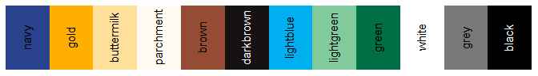

<!-- README.md is generated from README.Rmd. Please edit that file -->

# CCAO Package <a href='https:/glue.tidyverse.org'></a>

A package to manage, distribute, and version control *CCAO-specific*
functions. These functions are used throughout CCAO applications,
models, and diagnostics. For generalized versions of assessment-related
functions, see
[assessR](https://gitlab.com/ccao-data-science---modeling/packages/assessr).

## Installation

You can install the released version of `ccao` directly from GitLab by
running the following R command after installing `remotes`:

``` r
remotes::install_gitlab("ccao-data-science---modeling/packages/ccao")
```

Once it is installed, you can use it just like any other package. Simply
call `library(ccao)` at the beginning of your script.

## Included Functions and Data

##### Functions currently included in `ccao`:

  - `ccao_cod()`, `ccao_prd()`, `ccao_prb()` calculate assessment
    performance statistics in accordance with CCAO Data Science
    Department’s [Standard Operating Procedure on Sales Ratio
    Studies](https://gitlab.com/ccao-data-science---modeling/documentation/wiki_content/-/blob/f1efdcf7b66ab238efa438ee2f35e659222e76af/sops/sales-ratio-studies.md).
    The main changes are enforcement of outlier trimming (top and bottom
    5% of ratios are always dropped) and a strict minimum sample size (N
    must be \>= 30). Each function outputs a named list containing the
    statistic, its confidence interval, whether or not the IAAO standard
    was met, and the number of observations used to calculate the stat.

-----

  - `pin_format_pretty()` adds dash separators to input PINs to make
    them human-readable
  - `pin_clean()` removes separators and whitespace from input PINs and
    warns if a PIN is invalid

-----

  - `town_convert()` converts from township name to township number and
    visa versa
  - `town_get_triad()` returns the triad code or name of the input
    town(s)
  - `town_get_assmnt_year()` returns assessment year nearest to the
    `year` argument for a given input township

-----

  - `format_as400()` formats predicted values in the specification
    necessary to upload to the AS/400

##### Data currently included in `ccao`:

  - `appeal_dict` is a dictionary of appeal reason codes used in CCAO
    internal systems.
  - `ccao_colors` is a named list of CCAO Comms Department colors, see
    below for palette
  - `cdu_dict` is a dictionary of CCAO condition-desirability-utility
    (CDU) codes. These codes are usually used to represent different
    incentive conditions
  - `chars_dict` is a crosswalk of human-readable translations of CCAO
    database characteristic codes
  - `class_dict` is a dictionary of property class numeric codes and
    their human-readable equivalent
  - `nbhd_recodes` contains recodes for individual neighborhoods
  - `nbhd_shp` is a spatial (sf) data frame containing boundaries of
    CCAO neighborhoods<sup>1</sup>
  - `town_dict` is a crosswalk of township names, their equivalent
    numeric codes, and the triad they are in
  - `town_shp` is a spatial (sf) data frame containing boundaries of
    Cook County townships<sup>1</sup>

<sup>1</sup> :warning: The `sf` library **must** be loaded first in
order to load this data. If you encounter the error `C stack usage
{number} is too close to the limit` when loading the data, update your
version of `sf`

## Example Usage

This package contains spatial data frames representing CCAO
administrative boundaries. Note that you **must have the `sf` package
installed and loaded** in order to correctly load spatial data frames.

``` r
library(sf)
library(ccao)

# Plot township boundaries alone
plot(ccao::town_shp[1], main = "Township Boundaries")
```



``` r
# Plot township boundaries with neighborhoods
plot(ccao::nbhd_shp[1], main = "Townships with Neighborhoods")
```


## CCAO Colors


