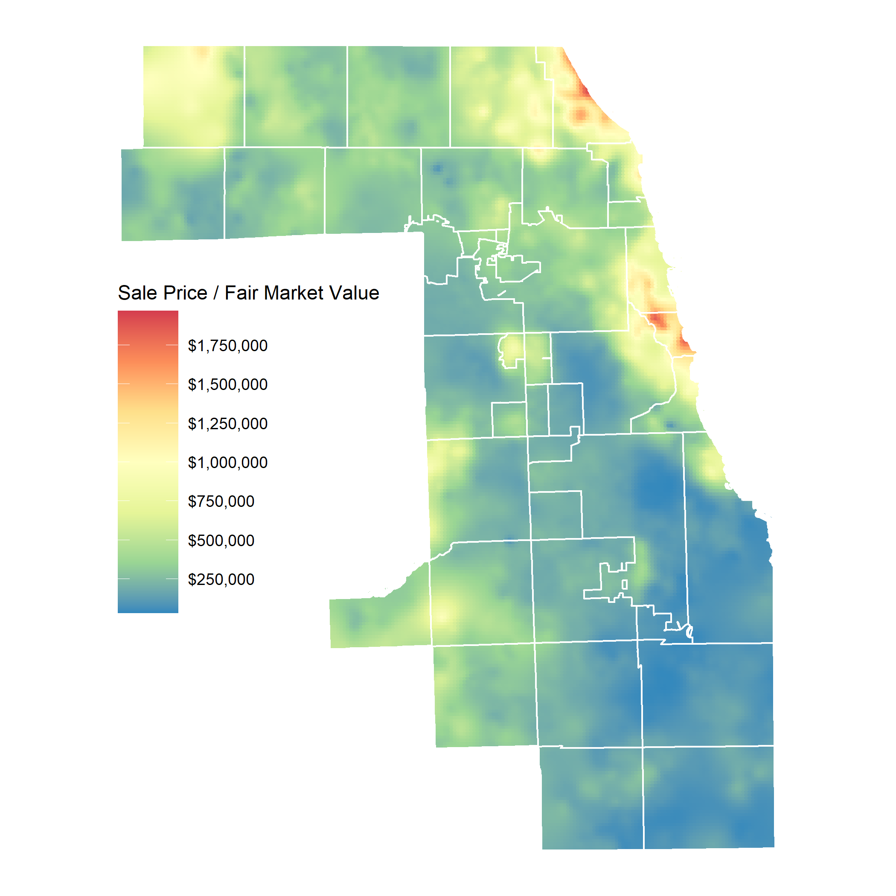

<script>
function plot_switch(id1, id2) {
    var x = document.getElementById(id1);
    var y = document.getElementById(id2);
    if (x.style.display === "none") {
        x.style.display = "block";
        y.style.display = "none";
    } else {
        x.style.display = "none";
        y.style.display = "block";
    }
}

document.addEventListener("DOMContentLoaded", function() {
  plot_switch('map2', 'map1');
});
</script>

<style>
.toggle_button {
  color: #fff !important;
  text-transform: uppercase;
  text-decoration: none;
  font-weight: bold;
  background: #CD5C5C;
  padding: 10px;
  display: inline-block;
  border: none;
  width: 36%;
  margin-top: 2px;
  margin-bottom: 50px;
  margin-left: 32%;
  margin-right: 32%
}
</style>


```{r, include=FALSE}
knitr::opts_chunk$set(
  collapse = TRUE,
  comment = "#>",
  eval = FALSE
)
```

## 

```{r, message=FALSE}
# Load libraries for this vignette
library(dplyr)
library(ggplot2)
library(sf)
library(jsonlite)
library(assessr)
library(ccao)
library(gstat)

# Load assessment data for Evanston
assessments <- read_json(
  "https://datacatalog.cookcountyil.gov/resource/uqb9-r7vn.json?$limit=2000000&year=2019",
  simplifyVector = TRUE
) %>%
  select(pin, certified)
  

# Load sales data, keep only 'good' sales, then merge on assessed values for sales
sales <- read_json(
  "https://datacatalog.cookcountyil.gov/resource/5pge-nu6u.json?$limit=500000&sale_year=2019",
  simplifyVector = TRUE
  ) %>%
  filter(
    sale_year == 2019,
    sale_price >= 10000,
    !class %in% c(211, 212, 299),
    as.numeric(rooms) <= 14,
    !is.na(centroid_x)
  ) %>%
  # Transform lat and lon into Illinois-specific projection
  select(pin, sale_price, lon = centroid_x, lat = centroid_y) %>%
  st_as_sf(coords = c("lon", "lat"), crs = 4326) %>%
  st_transform(3435) %>%
  # Keep assessed values where an equivalent sale exists
  left_join(assessments, by = "pin")

# Load the township boundary from the ccao package
boundary <- st_transform(ccao::town_shp, 3435)
```

```{r kriging, message=FALSE, results='hide', warning=FALSE}
# Calculate the kriging surface for sales. Takes a VERY long time, depending
# on the number of sales
sales_k <- sales %>%
  st_transform(3435) %>%
  map_kriging(
    sale_price,
    boundary = boundary,
    cellsize = 1000,
    model = gstat::vgm("Sph"),
    nmax = 1000
  ) %>%
  select(price = var1.pred)

# Calculate kriging surface for assessed values
assmnt_k <- sales %>%
  st_transform(3435) %>%
  map_kriging(
    certified,
    boundary = boundary,
    cellsize = 1000,
    model = gstat::vgm("Sph"),
    nmax = 1000
  ) %>%
  select(price = var1.pred)
```

```{r create_plot, message=FALSE, cache=FALSE}
# Create a scale using the combined range of both datasets
plot_lims <- range(c(sales_k$price, assmnt_k$price))

# Create buffered boundary to use as clipping mask for county edges
boundary_buf <- st_union(boundary) %>%
  st_buffer(500) %>%
  st_cast("POLYGON") %>% 
  st_cast("LINESTRING") %>%
  st_buffer(700)

# Create a map of the interpolated data
create_map <- function(df, plot_lims) {
  
  ggplot(df) +
    geom_sf(aes(fill = price, color = price)) +
    geom_sf(data = boundary, color = "white", fill = "transparent") +
    geom_sf(data = boundary_buf, color = "white", fill = "white") +
    scale_color_distiller(
      name = "Sale Price / Fair Market Value",
      palette = "Spectral",
      breaks = scales::extended_breaks(9),
      labels = scales::dollar,
      direction = -1,
      limits = plot_lims
    ) +
    scale_fill_distiller(
      name = "Sale Price / Fair Market Value",
      palette = "Spectral",
      breaks = scales::extended_breaks(9),
      labels = scales::dollar,
      direction = -1,
      limits = plot_lims
    ) +
    scale_x_continuous(expand = c(0, 0)) +
    theme_void() +
    theme(
      legend.position = c(0.2, 0.5),
      legend.key.size = unit(1.2, "cm"),
      plot.margin = margin()
    ) 
}

# Save and render the final map
p <- sales_k %>% create_map(plot_lims)
ggsave("county_sales.png", plot = p, width = 7, height = 7)
```


<div id="map1">

### Map of 2019 Sale Prices in Evanston


</div>


<div id="map2">

### Map of 2019 Certified Assessed Values in Evanston


```{r, message=FALSE, echo=FALSE, out.width='100%'}
p <- assmnt_k %>% create_map(plot_lims)
ggsave("county_assessments.png", plot = p, width = 7, height = 7)
```
</div>

<button class=toggle_button onclick="plot_switch('map1', 'map2')">Toggle Between 2019 Sales and Assessed Values</button>

