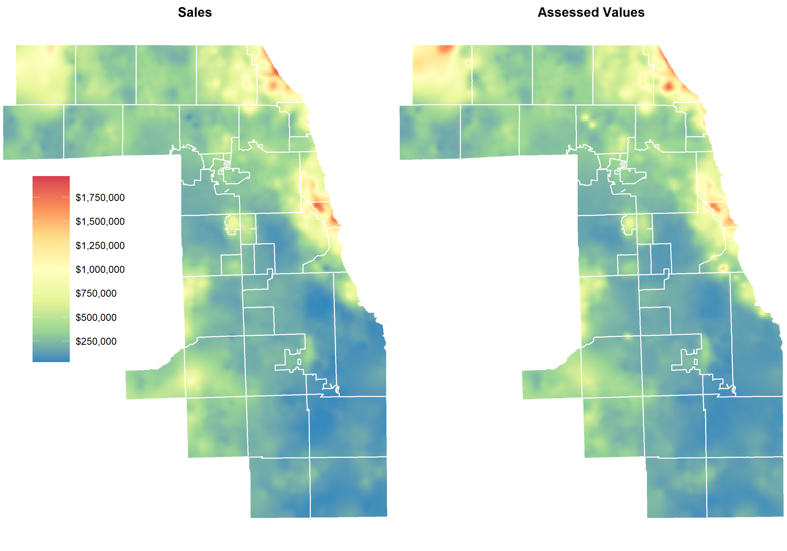

```{r, include=FALSE}
knitr::opts_chunk$set(
  collapse = TRUE,
  comment = "#>",
  eval = FALSE
)
```

[Kriging](https://en.wikipedia.org/wiki/Kriging) is the process of interpolating values over space using the covariance between values. It can be used to generate maps with smoothed, continuous estimates from point data. For our purposes, kriging can be used to create maps which show prices across all of Cook County. These maps can be used to compare estimated assessed values with actual sale prices, as shown below.

## Loading the data

In order to create a kriging map, we need two things:

1. Some sort of spatially distributed points that have an associated continuous variable value
2. A boundary file that acts as a clipping mask, such that only estimated values from within the boundary are returned

In this example case, we'll use 2019 point data from Cook County for (1) and a boundary of Cook County for (2). We'll then create a side-by-side map comparing sales to assessed values.

```{r, message=FALSE}
# Load libraries for this vignette
library(dplyr)
library(ggplot2)
library(sf)
library(jsonlite)
library(assessr)
library(ccao)
library(gstat)

# Load all assessment data for 2019
assessments <- read_json(
  "https://datacatalog.cookcountyil.gov/resource/uqb9-r7vn.json?$limit=2000000&year=2019",
  simplifyVector = TRUE
) %>%
  select(pin, certified)
  
# Load sales data, keep only 'good' sales, then merge assessed value for each sale
sales <- read_json(
  "https://datacatalog.cookcountyil.gov/resource/5pge-nu6u.json?$limit=500000&sale_year=2019",
  simplifyVector = TRUE
  ) %>%
  filter(
    sale_year == 2019,
    sale_price >= 10000,
    !class %in% c(211, 212, 299),
    as.numeric(rooms) <= 14,
    !is.na(centroid_x)
  ) %>%
  # Transform lat and lon into Illinois-specific, meters-based projection
  select(pin, sale_price, lon = centroid_x, lat = centroid_y) %>%
  st_as_sf(coords = c("lon", "lat"), crs = 4326) %>%
  st_transform(3435) %>%
  # Keep assessed values where an equivalent sale exists
  left_join(assessments, by = "pin")

# Load the township boundary from the ccao package, reproject it into the same
# projection as above
boundary <- st_transform(st_set_crs(ccao::town_shp, 4326), 3435)
```

## Kriging the data

Once we have both our point data (sales/assessed values) and our boundary file, we can use the `map_kriging()` function to create a kriging surface. `map_kriging()` works by first creating a grid of squares that covers the entire range of the point data/boundary. It then uses ordinary kriging to estimate the value for each of these squares given the input point data.

Here we'll create two separate surfaces, one for sales and one for assessed values. Note that creating these surfaces is **very** computationally expensive. Each one takes roughly 3 hours to calculate. It's possible to lower the computation time by:

- Changing the `cellsize` parameter to something larger. Here `cellsize` is set to 1000, meaning each cell is a 1 km by 1 km square.
- Setting the `nmax` or `maxdist` arguments to something low. By default, kriging works by comparing each observation to *all other* observations. This is quite expensive and is likely unnecessary for a place as large as Cook County.
- Lowering the number of points in the input data. The maps below use roughly 40K observations, but a similar map can be created using a random sample of the point data.

```{r kriging, message=FALSE, results='hide', warning=FALSE}
# Calculate the kriging surface for sales
sales_k <- sales %>%
  st_transform(3435) %>%
  map_kriging(
    sale_price,
    boundary = boundary,
    cellsize = 1000,
    model = gstat::vgm("Sph"),
    nmax = 1000
  ) %>%
  select(price = var1.pred)

# Calculate kriging surface for assessed values
assmnt_k <- sales %>%
  st_transform(3435) %>%
  map_kriging(
    certified,
    boundary = boundary,
    cellsize = 1000,
    model = gstat::vgm("Sph"),
    nmax = 1000
  ) %>%
  select(price = var1.pred)
```

## Creating the map

Finally, we can plot the output of `map_kriging()` to create a map of Cook County. Here we've combined both the sales and assessed value kriging surfaces in order to create a side-by-side map. This facilitates easy comparison. Ideally, the maps should look very similar. Hot or cool spots on one map that are not reflected on the other may indicate problems in assessment. 

Note, the `boundary_buf` object here is a buffered boundary of Cook County which is used to mask the otherwise jagged edges of the kriging surface (due to its makeup of 1 km by 1 km squares). 

```{r create_plot, message=FALSE, cache=FALSE}
# Create a scale using the combined range of both datasets
plot_lims <- range(c(sales_k$price, assmnt_k$price))

# Create buffered boundary to use as clipping mask for county edges
boundary_buf <- st_union(boundary) %>%
  st_buffer(500) %>%
  st_cast("POLYGON") %>% 
  st_cast("LINESTRING") %>%
  st_buffer(700)

# Combine both datasets and plot them side-by-side
bind_rows(
  sales_k %>% mutate(type = "Sales"),
  assmnt_k %>% mutate(type = "Assessed Values")
) %>%
  mutate(type = factor(type, levels = c("Sales", "Assessed Values"))) %>%
ggplot() +
  geom_sf(aes(fill = price, color = price)) +
  geom_sf(data = boundary, color = "white", fill = "transparent") +
  geom_sf(data = boundary_buf, color = "white", fill = "white") +
  scale_color_distiller(
    name = "",
    palette = "Spectral",
    breaks = scales::extended_breaks(9),
    labels = scales::dollar,
    direction = -1,
    limits = plot_lims
  ) +
  scale_fill_distiller(
    name = "",
    palette = "Spectral",
    breaks = scales::extended_breaks(9),
    labels = scales::dollar,
    direction = -1,
    limits = plot_lims
  ) +
  scale_x_continuous(expand = c(0, 0)) +
  facet_wrap(vars(type), nrow = 1) +
  theme_void() +
  theme(
    strip.text = element_text(size = 12, face = "bold"),
    legend.position = c(0.1, 0.54),
    legend.key.size = unit(1.2, "cm"),
    plot.margin = margin()
  ) 

# Save the final map
ggsave("county_sales_fmv.png", width = 10, height = 7)
```

### Map of 2019 Sales vs. Assessed Values (Single-Family Homes Only)

